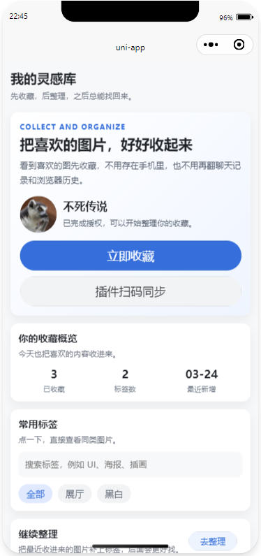
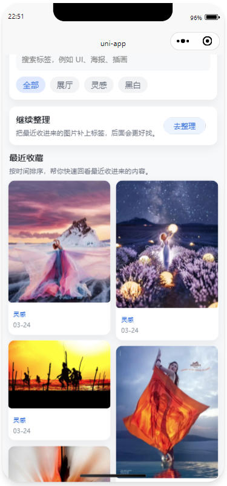
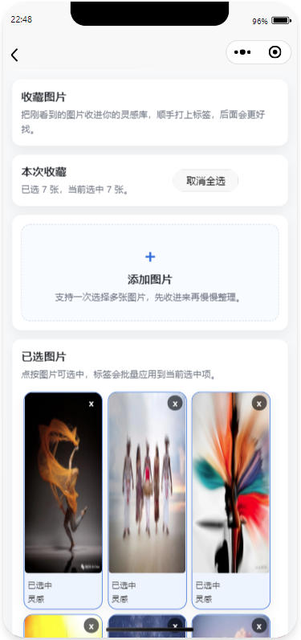
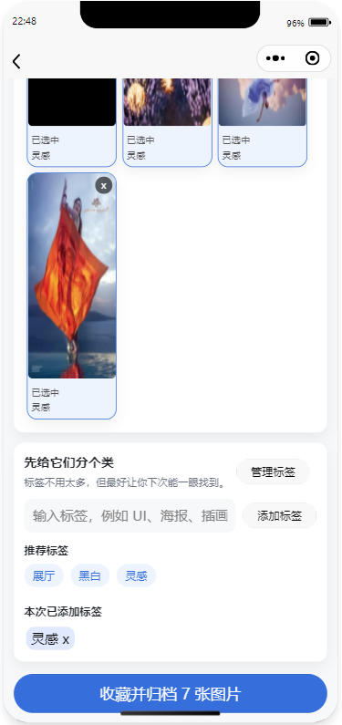
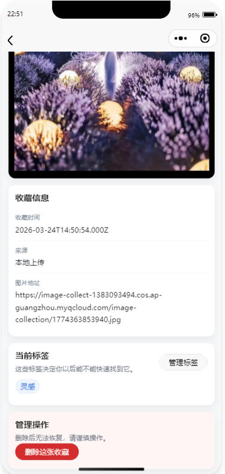
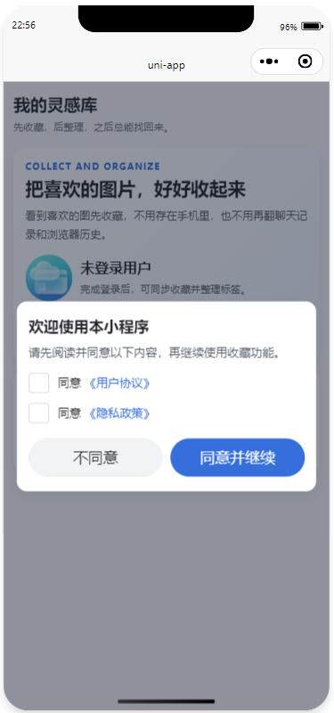

# Image Collection System

一个用于收藏、整理和回找图片的小型系统，包含：

- Spring Boot 后端
- uni-app 微信小程序前端
- Chrome 浏览器插件

这个项目的目标不是把图片“存到手机里”，而是把喜欢的图片收进个人灵感库，之后通过标签进行整理和回找。

## 功能概览

- 收藏网页图片
- 本地上传图片
- 图片标签管理
- 图片详情查看
- 插件扫码登录小程序
- 支持本地存储或 COS 存储

## 项目截图

### 首页



### 收藏页



### 详情页


### 协议页


### 浏览器插件


## 技术栈

### 后端

- Java 17
- Spring Boot 4
- MyBatis
- MySQL
- Nginx

### 前端

- uni-app
- Vue 3 `<script setup>`
- 微信小程序

### 插件

- Chrome Extension Manifest V3

## 目录结构

```text
.
├─backend/   Spring Boot + MyBatis + MySQL
├─frontend/  uni-app 小程序
├─plugin/    Chrome 插件
├─assets/    README 截图等静态资源
├─DEPLOY_TENCENT.md
└─README.md
```

## 页面说明

### 首页

- 收藏库首页
- 展示收藏概览
- 支持常用标签筛选
- 展示最近收藏图片

### 收藏页

- 批量选择图片
- 批量添加标签
- 收藏并归档

### 详情页

- 查看大图
- 标签管理
- 删除收藏
- 查看收藏信息

## 本地开发

### 后端

```bash
cd backend
./gradlew bootRun
```

或者构建 jar：

```bash
cd backend
./gradlew clean bootJar
```

默认端口：

```text
8080
```

### 小程序前端

- 目录：`frontend/`
- 将项目导入 HBuilderX 或 uni-app 对应开发工具后编译到微信小程序

### 浏览器插件

- 目录：`plugin/`
- 在 Chrome 中通过“加载已解压的扩展程序”导入 `plugin/` 目录即可

## 部署说明

腾讯云部署和当前演示环境说明见：

- [DEPLOY_TENCENT.md](DEPLOY_TENCENT.md)
